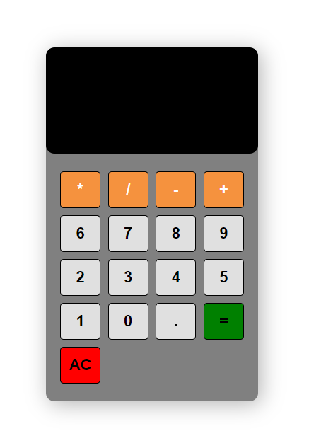

# Simple Calculator App

This is a simple calculator web application built using HTML, CSS, and JavaScript.

## Table of Contents


## Demo
You can see a live demo of the calculator app here: [Demo Link](https://sufianadnan.github.io/Simple-Calculator/)



## Features

- Basic arithmetic operations: addition, subtraction, multiplication, division.
- Clear button to reset the input.
- Error handling for invalid expressions.
- Responsive design for various screen sizes.

## Getting Started

To run this calculator locally, follow these steps:

1. Clone the repository:

   ```bash
   git clone https://github.com/your-username/calculator-app.git
